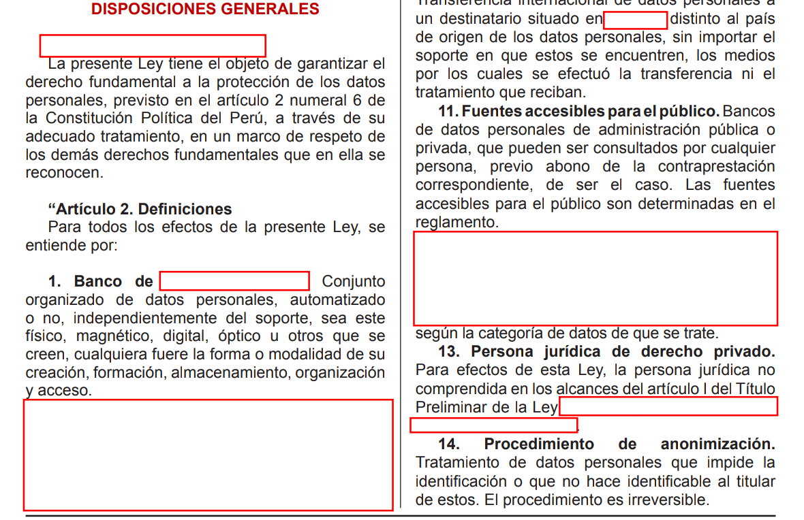
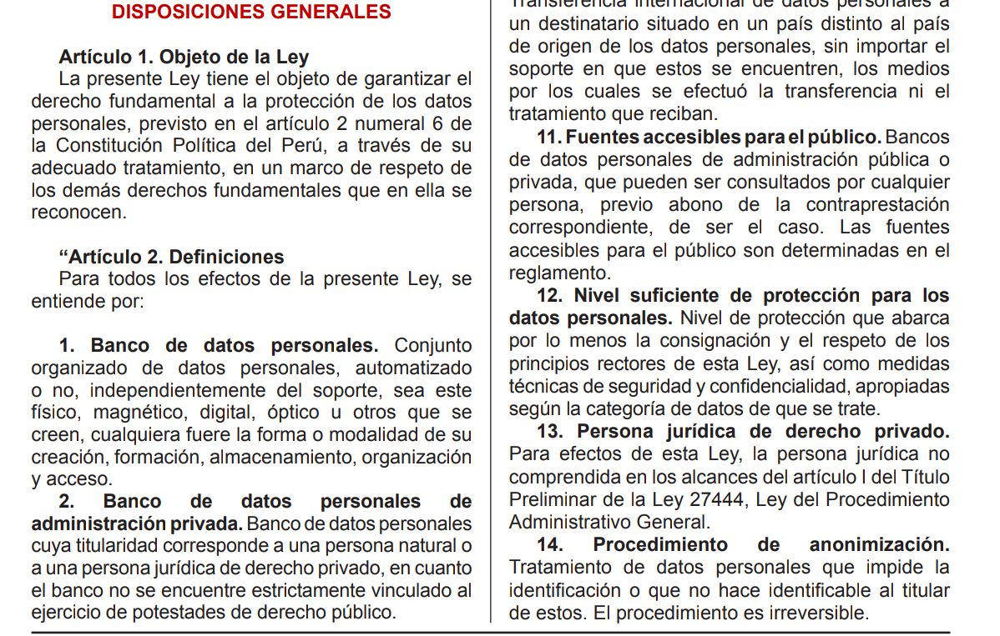
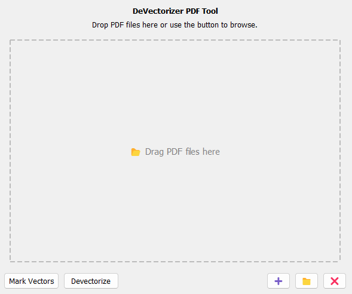

# 🧹 DeVectorizer PDF Tool

**DeVectorizer PDF Tool** es una aplicación de escritorio desarrollada en Python con PyQt5 que permite analizar archivos PDF para identificar y/o eliminar vectores superpuestos (usualmente utilizados como una forma incorrecta de anonimización visual). Esta herramienta es útil para evaluar la integridad de la anonimización aplicada en documentos digitalizados, como laudos arbitrales u otros documentos institucionales.

---

## 📌 Propósito

Esta herramienta ha sido diseñada como **prueba técnica de exposición de riesgos**. Permite demostrar cómo, en algunos documentos oficiales, la información sensible no ha sido eliminada sino simplemente cubierta con vectores blancos. Al utilizar este software, se pueden:

- Visualizar los vectores blancos utilizados como ocultadores.
- Remover dichos vectores para exponer el contenido subyacente.
- Evaluar si un documento ha sido correctamente anonimizado.

---

## 🧠 Funcionalidades principales

- 📂 **Carga de archivos PDF** mediante botón o arrastre.
- 🔴 **Marcado de vectores blancos**: Resalta visualmente (en rojo) las zonas cubiertas por vectores blancos, sin alterar el contenido original.
- ❌ **Desvectorización**: Elimina los vectores y conserva únicamente las imágenes renderizadas del documento, haciendo visible el texto oculto si lo hubiera.
- 📁 **Acceso rápido a la carpeta de resultados**.
- 🧼 **Limpieza de lista de archivos cargados**.
- 💡 **Placeholder visual** para guiar al usuario al inicio.

---

## 🖥️ Interfaz gráfica

La herramienta cuenta con una interfaz amigable y sencilla:

- Área central para arrastrar archivos PDF.
- Botones:
  - ➕: Agregar archivos
  - 📁: Abrir carpeta de resultados
  - ❌: Limpiar lista
  - `Mark Vectors`: Marcar los vectores blancos con borde rojo
  - `Devectorize`: Remover vectores completamente

---

## 📸 Ejemplos visuales

### Ejemplo 1 – Detección de vectores blancos

| Documento publicado (ocultamiento visual) | Documento desvectorizado (texto expuesto) |
|:-----------------------------------------:|:------------------------------------------:|
|    |     |

> En este ejemplo se observa cómo los vectores blancos cubren los datos sensibles sin eliminarlos. Al desvectorizar, el texto subyacente se hace visible.

---

### 🧩 Interfaz de usuario

La interfaz de la herramienta es limpia y funcional:



> Área central de arrastre, botones funcionales y mensajes contextuales para guiar al usuario.

---

## 🛠️ Instalación

### Requisitos:

- Python 3.7+
- PyQt5
- PyMuPDF (`fitz`)
- Pillow

### Instalación rápida (entorno virtual recomendado):

```bash
pip install PyQt5 pymupdf pillow
```

---

## ▶️ Uso

1. Ejecuta la aplicación:

```bash
python main.py
```

2. Arrastra archivos PDF al área central o usa el botón ➕.
3. Presiona:
   - `Mark Vectors` para resaltar los vectores blancos.
   - `Devectorize` para eliminar los vectores y conservar únicamente las imágenes.
4. Los resultados aparecerán en las carpetas:

```
results/
├── marked/         # PDFs con vectores marcados
└── devectorized/   # PDFs desvectorizados
```

5. Usa el botón 📁 para abrir rápidamente la carpeta `results/`.

---

## 📁 Estructura del proyecto

```
DeVectorizer/
├── main_window.py               # Interfaz principal (PyQt5)
├── functions/
│   ├── file_handler.py          # Añadir, limpiar, obtener archivos
│   ├── mark_vectors.py          # Función para marcar vectores
│   └── devectorize.py           # Función para desvectorizar PDF
├── results/
│   ├── marked/
│   └── devectorized/
```

---

## ⚠️ Nota legal

> Esta herramienta se ha desarrollado exclusivamente con fines académicos y técnicos. No contiene ni distribuye datos personales reales. Su propósito es evidenciar riesgos técnicos relacionados a la publicación de documentos PDF que aparentan estar anonimizados.

---

## 👨‍💻 Autor

Raúl Guillermo Lévano Cutiño  
Universidad de Lima – Ingeniería de Sistemas  